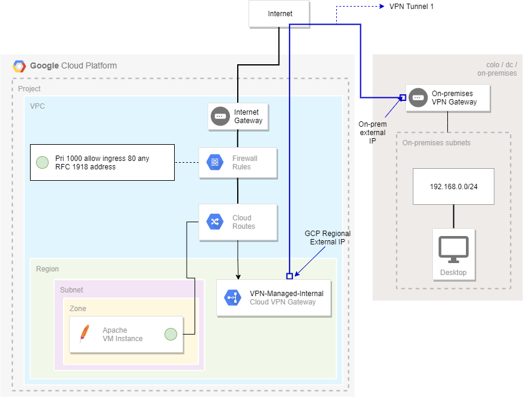

# Deploy an HA VPN with a single tunnel

This tutorial demonstrates how to use Terraform to deploy the High Availability VPN resources on Google Cloud thar are used in the [interoperability guides](https://cloud.google.com/community/tutorials/deploy-ha-vpn-with-terraform)

## Objectives

Deploy a HA VPN with a 1-peer addresses configured on Google Cloud.

## Architecture

## Features

* Create a single instance running Apache
* Create a VPN HA Gateway
* Create a single VPN tunnel back to an on-premises data center using [static routing](https://cloud.google.com/network-connectivity/docs/vpn/how-to/creating-static-vpns)

## Pre-requirements
* A GCP project must already exist
* IAP API must be enabled and appropriate IAM permissions to allow connectivity to the private test instance
* Have access to a third party VPN Gateway. This can be deployed in another cloud provider or an on-premises data center.

## Software Dependencies

* Terraform > v0.13
* Terraform provider for GCP > v3.55

## Deploy

* `terraform init` to initialize the deployment
* `terraform plan -var=project_id=<my-project> -var=remote_subnet=["192.168.0.0/24"] -var=peer_ips=["8.8.8.8"]` to plan what infrastructure will be deployed.
* `terraform apply -var=project_id=<my-project> -var=remote_subnet=["192.168.0.0/24"] -var=peer_ips=["8.8.8.8"]` apply the infrastructure =.
* `terraform destroy` to clean up the project.
## Inputs

| Name | Description | Type | Default | Required |
|------|-------------|------|---------|:--------:|
|  [project\_id](#input\_project\_id) | The GCP project ID | `string` | n/a | yes | 
|  [peer\_ips](#input\_peer\_ips) | External IP address | `list(string)` | n/a | yes ||  [project\_id](#input\_project\_id) | Project ID | `string` | n/a | yes |
|  [region](#input\_region) | The GCP region to deploy resources. | `string` | `"us-central1"` | no |
|  [remote\_subnet](#input\_remote\_subnet) | The subnets at the remote location. Use the on-premises CIDR. | `list(string)` | n/a | yes |
|  [shared\_secret](#input\_shared\_secret) | The shared secret between tunnels. | `string` | `"mySecret"` | no |
|  [zone](#input\_zone) | The GCP zone to deploy resources into. | `string` | `"us-central1-b"` | no |

## Outputs

| Name | Description |
|------|-------------|
|  [apache\_instance\_address](#output\_apache\_instance\_address) | The Apache instance IP address. |
|  [gateway\_ip](#output\_gateway\_ip) | The VPN Gateway Public IP |
|  [gateway\_self\_link](#output\_gateway\_self\_link) | The self-link of the Gateway |
|  [ipsec\_secret-static](#output\_ipsec\_secret-static) | The shared secret is: |
|  [vpn\_tunnels\_names-static](#output\_vpn\_tunnels\_names-static) 
| The VPN tunnel name is |

## Usage

Confirm you're able to reach the Apache web server from the on-premises data center.

## References

* [HA VPN](https://cloud.google.com/network-connectivity/docs/vpn/concepts/topologies#1-peer-2-addresses)
* [Third party VPNs](https://cloud.google.com/network-connectivity/docs/vpn/how-to/interop-guides)