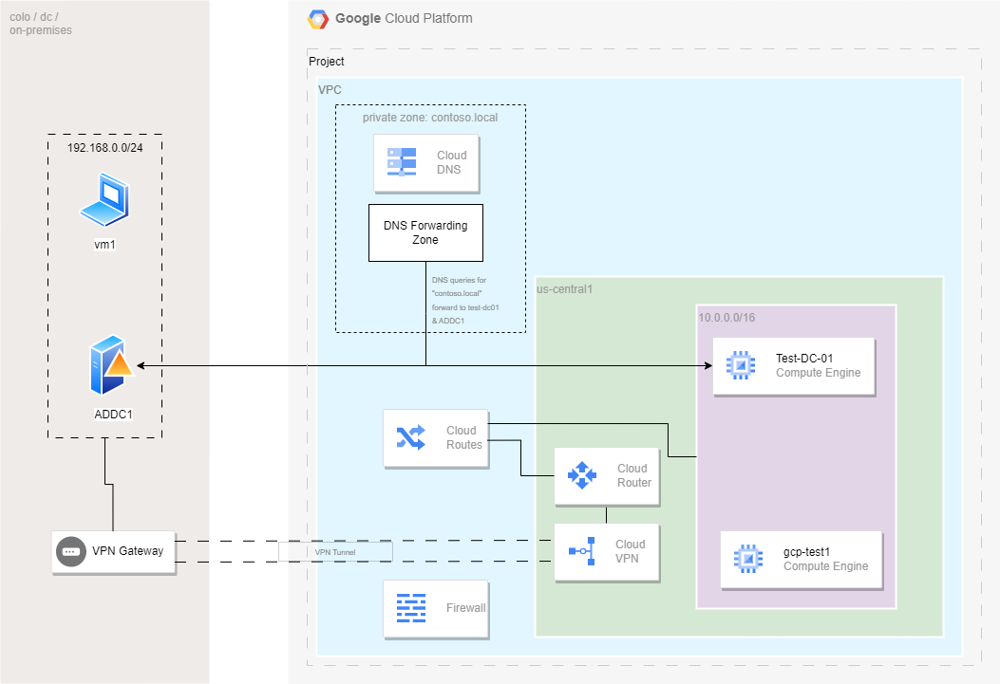

# Terraform Code to deploy Microsoft ADDC in extended mode with DNS Forwardning

The code here deploys Microsoft Active Directory Domain Controllers including the network environment, firewall rules, and Cloud DNS. You will need to manually configure and promote the domain controllers and configure site replication.

<!-- ## Objectives

* Deploy a HA VPN with a 1-peer addresses configured on Google Cloud.
* Deploy an On-premises Active Directory Domain Controller (code not available)
* Deploy an Active Directory Domain Controller in Google Cloud
    * Configure Active Directory with an [extended forest](https://cloud.google.com/architecture/patterns-for-using-active-directory-in-a-hybrid-environment#extended_forest) -->

## Architecture



## Features

* Create the network environment including routing and firewall rules.
* Deploy a Classic VPN Gateway connecting to an on-premises VPN gateway.
    * You must manually configure the on-prem Gateway.
* Create a Cloud DNS private zone with DNS forwarding rules.
* Create a single domain controller in a single zone.
* Configure Acitve Directory Sites & Replication.

## Pre-requirements
* A GCP project must already exist
* An on-premises Active Directory Domain Controller

## Software Dependencies

* Terraform > v0.13
* Terraform provider for GCP > v3.55

## Deploy

* `terraform init` to initialize the deployment
* `terraform plan -var=project_id=<my-project> -var=remote_subnet=["192.168.0.0/24"] -var=peer_ips=["8.8.8.8"]` to plan what infrastructure will be deployed.
* `terraform apply -var=project_id=<my-project> -var=remote_subnet=["192.168.0.0/24"] -var=peer_ips=["8.8.8.8"]` apply the infrastructure =.
* `terraform destroy` to clean up the project.
<!-- BEGIN TFDOC -->

## Variables

| name | description | type | required | default |
|---|---|:---:|:---:|:---:|
| [peer_ips](variables.tf#L11) | External IP address | <code>list&#40;string&#41;</code> | ✓ |  |
| [project_id](variables.tf#L6) | The GCP project ID | <code>string</code> | ✓ |  |
| [api_services](variables.tf#L33) | What APIs services are available | <code>list&#40;string&#41;</code> |  | <code>&#91;&#34;dns.googleapis.com&#34;&#93;</code> |
| [auto_restart](variables.tf#L63) | Set if the instance should auto-restart. | <code>bool</code> |  | <code>false</code> |
| [boot_disk](variables.tf#L69) | What image the instance should boot from. | <code>string</code> |  | <code>&#34;windows-cloud&#47;windows-2022&#34;</code> |
| [dc_machine_type](variables.tf#L87) | Machine type to deploy for the Domain Controller | <code>string</code> |  | <code>&#34;e2-medium&#34;</code> |
| [environment](variables.tf#L27) | Environment | <code>string</code> |  | <code>&#34;test&#34;</code> |
| [preemptible](variables.tf#L57) | Set if this instance should be preemptible | <code>bool</code> |  | <code>true</code> |
| [prefix_hostname](variables.tf#L81) | The hostname prefix | <code>string</code> |  | <code>&#34;claddc&#34;</code> |
| [region](variables.tf#L39) | The GCP region to deploy resources. | <code>string</code> |  | <code>&#34;us-central1&#34;</code> |
| [remote_subnet](variables.tf#L16) | The subnets at the remote location. Use the on-premises CIDR. | <code>list&#40;string&#41;</code> |  | <code>&#91;&#34;192.168.0.0&#47;16&#34;&#93;</code> |
| [shared_secret](variables.tf#L51) | The shared secret between tunnels. | <code>string</code> |  | <code>&#34;mySecret&#34;</code> |
| [static_ip](variables.tf#L75) | The last octet in a static host ip address. | <code>number</code> |  | <code>10</code> |
| [zone](variables.tf#L45) | The GCP zone to deploy resources into. | <code>string</code> |  | <code>&#34;us-central1-b&#34;</code> |

## Outputs

| name | description | sensitive |
|---|---|:---:|
| [gateway_ip](outputs.tf#L6) | The VPN Gateway Public IP |  |
| [gateway_self_link](outputs.tf#L1) | The self-link of the Gateway |  |
| [ipsec_secret-static](outputs.tf#L16) | The shared secret is: | ✓ |
| [vpn_tunnels_names-static](outputs.tf#L11) | The VPN tunnel name is |  |

<!-- END TFDOC -->
## Usage

### Create and configure a Windows Domain Controller (On-Premises)

1. Create a VM instance in your hypervisor of choice.
1. Using RDP, connect to the domain controller VM with your local account username and password.
1. Open up a [PowerShell prompt with administrator privileges](https://docs.microsoft.com/en-us/powershell/scripting/windows-powershell/starting-windows-powershell?view=powershell-7.1#with-administrative-privileges-run-as-administrator) and copy and paste the following syntax. Then run the script.
    ```bash
    $domainName = "contoso.local"
    $netbiosName = "contoso"
    $safeModeAdminstratorPassword = ConvertTo-SecureString 'BestCloud1!' -AsPlainText -Force
    $logpath = "C:\log\log.txt"
    $domainMode = "Win2012R2"
    $forestMode = "Win2012R2"

    # Import-Module ADDSDeployment
    Install-ADDSForest `
    -CreateDnsDelegation:$false  `
    -DatabasePath "C:\Windows\NTDS" `
    -DomainMode $domainMode -ForestMode $forestMode `
    -DomainName $domainName `
    -DomainNetbiosName $netbiosname `
    -LogPath "C:\Windows\NTDS" `
    -NoRebootOnCompletion:$false `
    -SysvolPath "C:\Windows\SYSVOL" `
    -SafeModeAdministratorPassword $safeModeAdminstratorPassword `
    -Force:$true
    ```

### Configure Active Directory Sites

1. After the instance has rebooted, RDP back into the instance.
1. Open up a [PowerShell prompt with administrator privileges](https://docs.microsoft.com/en-us/powershell/scripting/windows-powershell/starting-windows-powershell?view=powershell-7.1#with-administrative-privileges-run-as-administrator):
    ```bash
    New-ADReplicationSite -Name "on-prem-location" -Description "Site1"
    New-ADReplicationSite -Name "GCP-us-central1" -Description "Site2"


### Configure site links for Active Directory Replication

1. Open up a elevated PowerShell shell prompt:
    ```bash
    New-ADReplicationSiteLink -Name "on-prem-GCP-us-central1" -SitesIncluded on-prem-location,GCP-us-central1 -Cost 250 -ReplicationFrequencyInMinutes 15 -InterSiteTransportProtocol IP
    ```

### Configure Subnets for Active Directory Sites

1. Open up a elevated PowerShell shell prompt:
    ```bash
    New-ADReplicationSubnet -Name "10.0.0.0/16" -Site "GCP-us-central1"

    New-ADReplicationSubnet -Name "192.168.0.0/24" -Site "on-prem-location"
    ```

### Add `test-us-central1-dc-01` to the appropriate site `GCP-us-central`

1. Open up a elevated PowerShell shell prompt:
    ```bash
    Move-ADDirectoryServer -Identity test-us-central1-dc-01 -Site "GCP-us-central1"
    ```

### Create and configure a Windows Domain Controller (GCP)

1. Generate a new local password from the [previous steps](##Create-and-configure-a-Windows-Domain-Controller) and [RDP](https://cloud.google.com/compute/docs/instances/connecting-to-instance#windows) to the instance.
1. Join the `us-central1` instance to the domain. 
1. After the reboot, open up a [PowerShell prompt with administrator privileges](https://docs.microsoft.com/en-us/powershell/scripting/windows-powershell/starting-windows-powershell?view=powershell-7.1#with-administrative-privileges-run-as-administrator):
    ```bash
    Import-Module ADDSDeployment
    Install-ADDSDomainController `
    -NoGlobalCatalog:$false `
    -CreateDnsDelegation:$false `
    -Credential (Get-Credential) `
    -CriticalReplicationOnly:$false `
    -DatabasePath "C:\Windows\NTDS" `
    -DomainName "contoso.local" `
    -InstallDns:$true `
    -LogPath "C:\Windows\NTDS" `
    -NoRebootOnCompletion:$false `
    -ReplicationSourceDC "test-us-central1-dc-01.contoso.local" `
    -SiteName "GCP-us-central1" `
    -SysvolPath "C:\Windows\SYSVOL" `
    -Force:$true
    ```
    >**Note**: May need to set the local DNS setting to point to the IP address of the first domain controller.


### Validate

1. In Google Cloud, create a VM called `test-vm`.
1. Generate a password so that you can connect to the domain controller. Record the username and password for future use.
    > Note: Wait for the instance to fully come online.
    ```bash
    gcloud compute reset-windows-password VM_NAME --zone=ZONE
    ```
1. RDP to the instance.
    **Note:** You should be able to RDP to the private IP of the `test-vm`. Your on-prem firewall as well as the GCP firewall should be properly configured for this access.
1. Join the `test-vm` to the domain.
    1. Open an elevated PowerShell command prompt:
        ```bash
        Add-Computer -DomainName contoso.local -Restart
        ```
1. Verify what domainc controller `test-vm` is registered to by RDP'ing back into the `test-vm` instance and in a `cmd` window type:
    ```bash
    echo %LOGONSERVER%
    ```
    You should see an output similar to the following, identifying `test-dc-01` as the active domain controller.
    ```bash
    \\test-dc-01
    ```
    If you're interested in exploring the DNS-based failover of domain controllers follow these steps:

    1. Sign out of the `test-vm`.
    1. Stop the `test-dc-01` and then log in to `test-vm` after the server has fully shutdown.
    1. After logging back into `test-vm` rerun `echo %LOGONSERVER%`, you can see that `\\addc1` has become the active domain controller.


## References

* [HA VPN](https://cloud.google.com/network-connectivity/docs/vpn/concepts/topologies#1-peer-2-addresses)
* [Third party VPNs](https://cloud.google.com/network-connectivity/docs/vpn/how-to/interop-guides)
* [Deploying Microsoft Active Domain Controllers with Advanced Networking Configuration on Google Cloud](https://cloud.google.com/architecture/deploying-microsoft-active-directory-domain-controllers-with-advanced-networking-configuration-on-gcp)
* [Microsoft SQL AlwaysOn Deployment](https://github.com/GoogleCloudPlatform/community/blob/master/tutorials/sql-server-ao-single-subnet/index.md)
* [Google Cloud Cloud DNS Best Practices](https://cloud.google.com/dns/docs/best-practices)
* [Google Cloud Classic VPN Topology](https://cloud.google.com/network-connectivity/docs/vpn/concepts/classic-topologies#simple_topology)