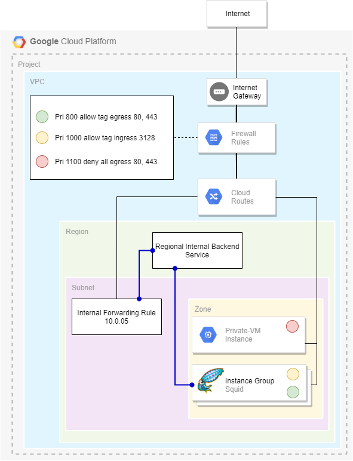

# A managed instance group of squid proxies

The objective of this lab is to deny any instance outbound internace access. Instead, the instance's outbound internet traffic must traverse a reverse proxy. The reverse proxy must be built will resiliency and allow outbound access.

## Architecture



## Features

* Creates a regional manages instance groups with a script to deploy squid proxies
* Creates an internal TCP load balancer in front of the managed instance group
* Creates a private-vm to test the configuration
* Applies the appropriate firewall rules to make the configuration work

## Pre-requirements
* A GCP project must already exist
* IAP API must be enabled and appropriate IAM permissions to allow connectivity to the private test instance

## Software Dependencies

* Terraform > v0.13
* Terraform provider for GCP > v3.55

## Deploy

* `terraform init` to initialize the deployment
* `terraform plan -var=project_id=<my-project>` to plan what infrastructure will be deployed.
* `terraform apply -var=project_id=<my-project>` to deploy the infrastructure
* `terraform destroy` to clean up the project.

## Inputs

| Name | Description | Type | Default | Required |
|------|-------------|------|---------|:--------:|
| <a name="input_labels_squid"></a> [labels\_squid](#input\_labels\_squid) | n/a | `map` | `{}` | no |
| <a name="input_project_id"></a> [project\_id](#input\_project\_id) | The Project ID | `string` | n/a | yes |
| <a name="input_proxy_count"></a> [proxy\_count](#input\_proxy\_count) | How many VMs to deploy | `number` | `1` | no |
| <a name="input_region"></a> [region](#input\_region) | VPC region | `string` | `"us-central1"` | no |
| <a name="input_squid_install_script_path"></a> [squid\_install\_script\_path](#input\_squid\_install\_script\_path) | The script path to install squid proxy. | `string` | `"./installer/squid_install.sh"` | no |
| <a name="input_tags_squid"></a> [tags\_squid](#input\_tags\_squid) | n/a | `list` | <pre>[<br>  "squid"<br>]</pre> | no |
| <a name="input_vm_size_squid"></a> [vm\_size\_squid](#input\_vm\_size\_squid) | Node instance type | `string` | `"g1-small"` | no |
| <a name="input_zone"></a> [zone](#input\_zone) | VPC Zone | `string` | `"us-central1-b"` | no |

## Outputs

| Name | Description |
|------|-------------|
| <a name="output_ilb_address"></a> [ilb\_address](#output\_ilb\_address) | TCP Internal load balancer address. |

## Usage

Once the solution has been successfully deployed, you should be able to run your traffic through the proxy by using localhost:3128.

You may configure your browser to use that address:port, or at the shell:
>**Note**: The internal IPs listed are of the TCP load balancer and may be different per deployment.

```bash
export ftp_proxy=http://10.0.0.5:3128
export http_proxy=http://10.0.0.5:3128
export https_proxy=http://10.0.0.5:3128
```