# How to install pfSense

After the [pfSense image has been created](../create-pfsense-image/), now install pfSense.

1. Navigate to the Compute Engine.
1. Select the Serial Console button. This will launch a new dialog window.
1. Follow the screenshots to install:

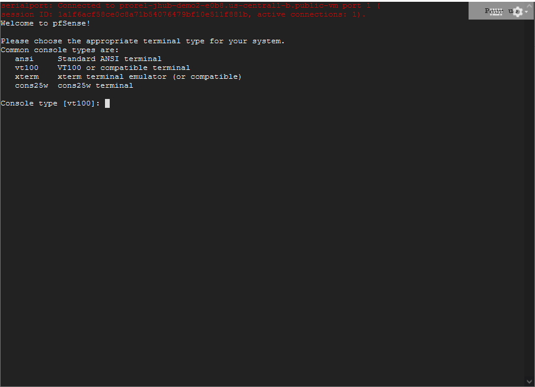

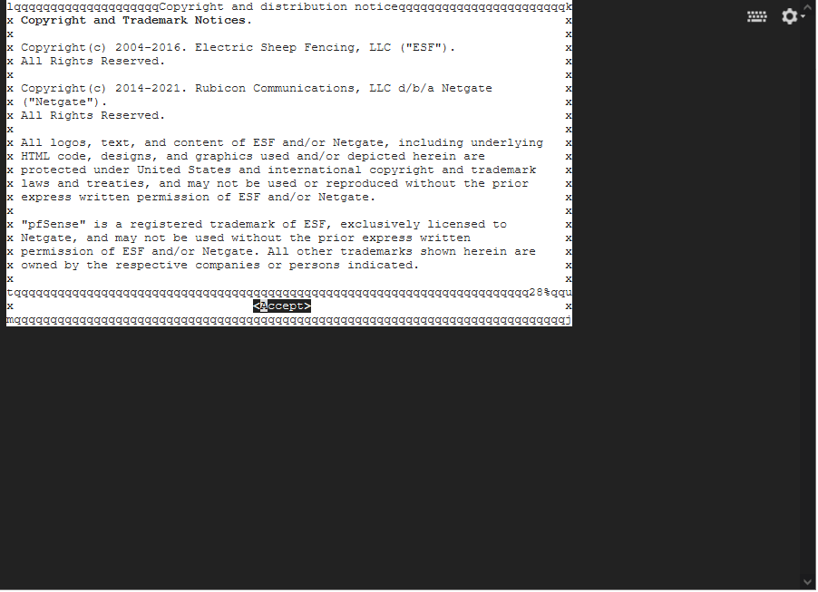

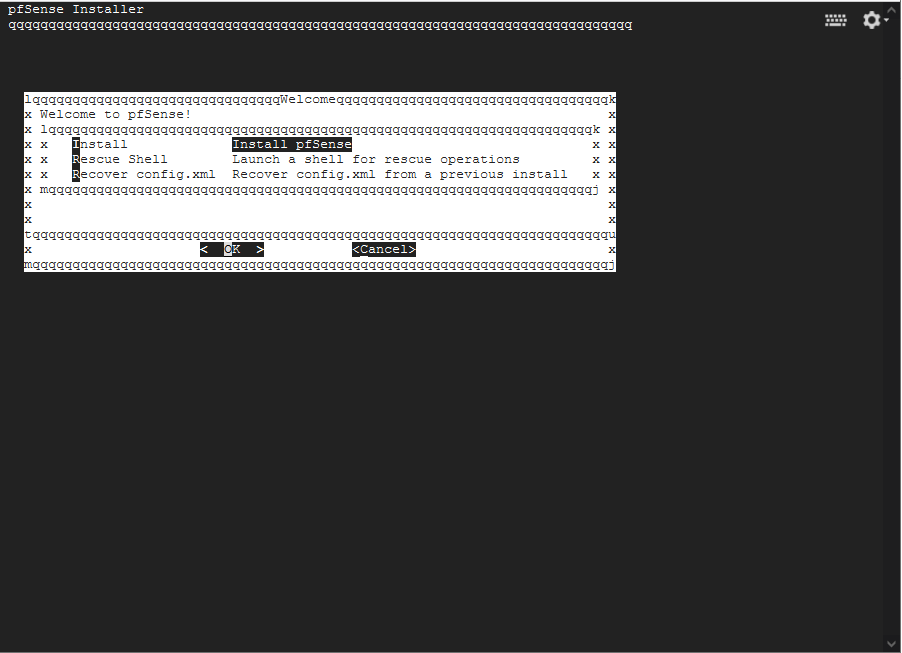

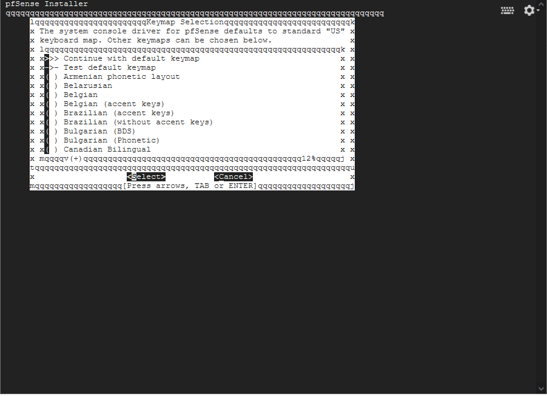

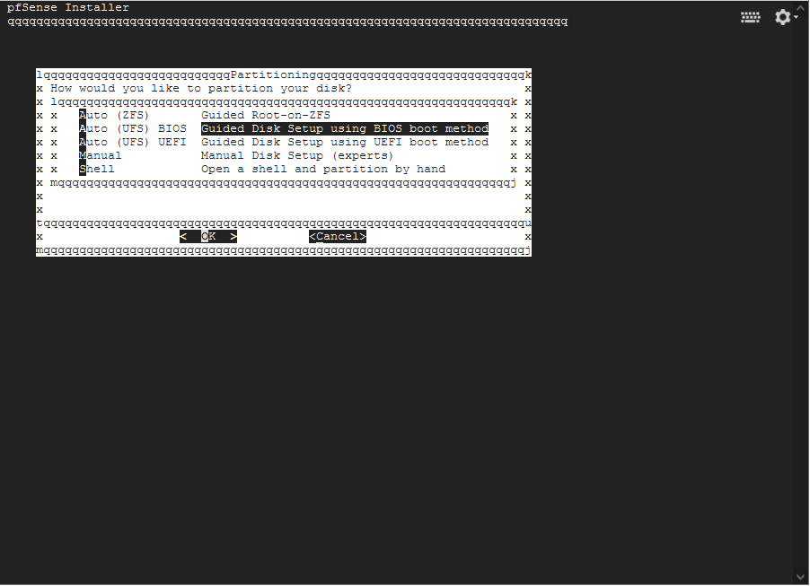

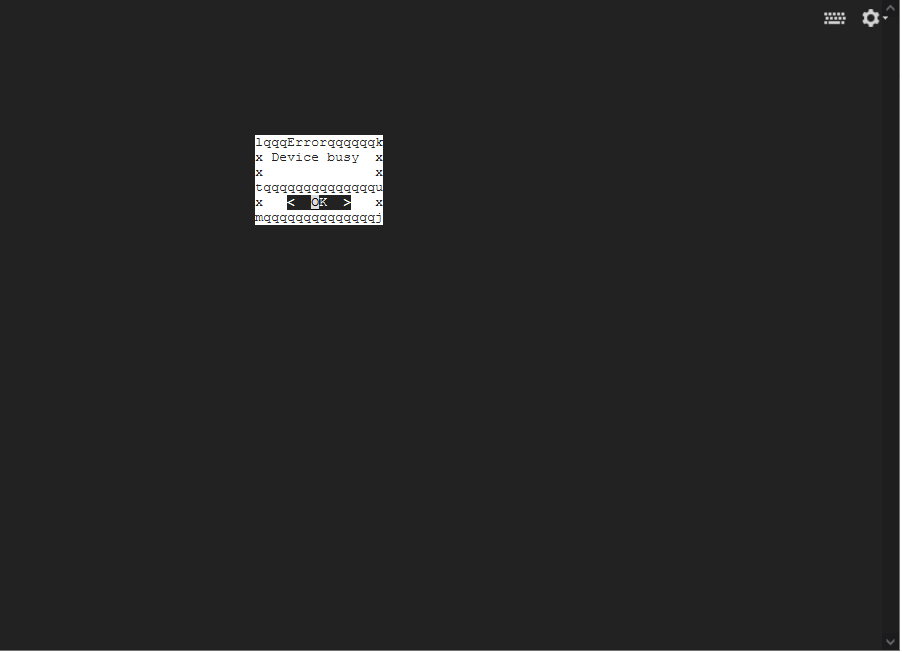

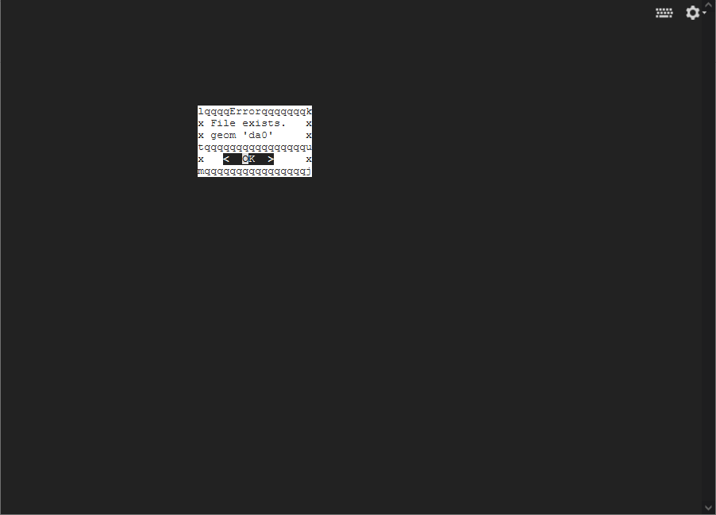

Make sure you select `Cancel` 
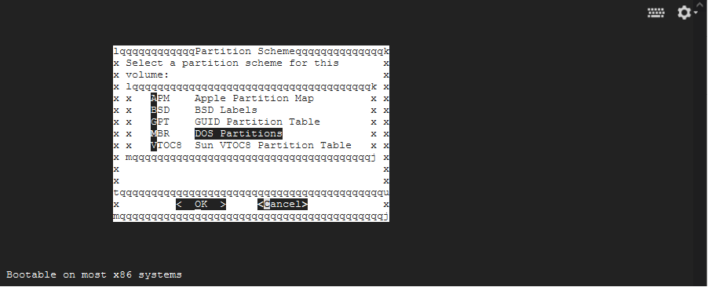

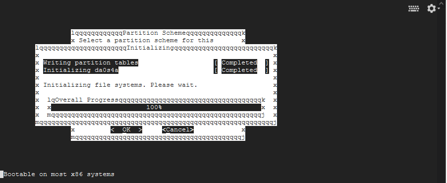

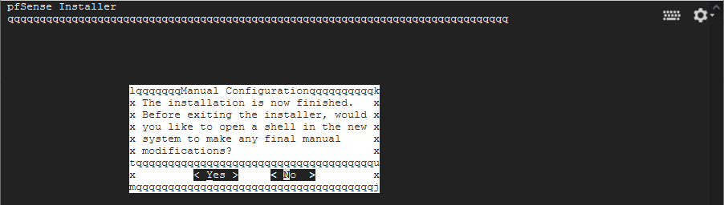

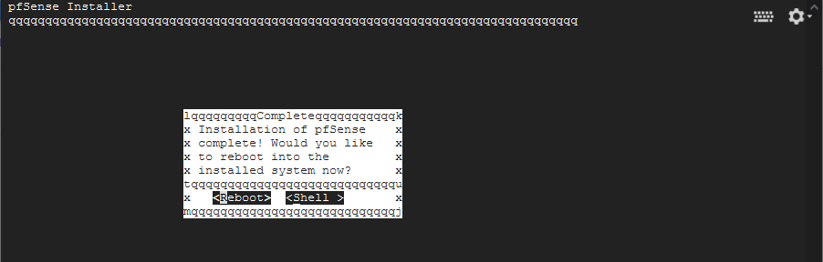

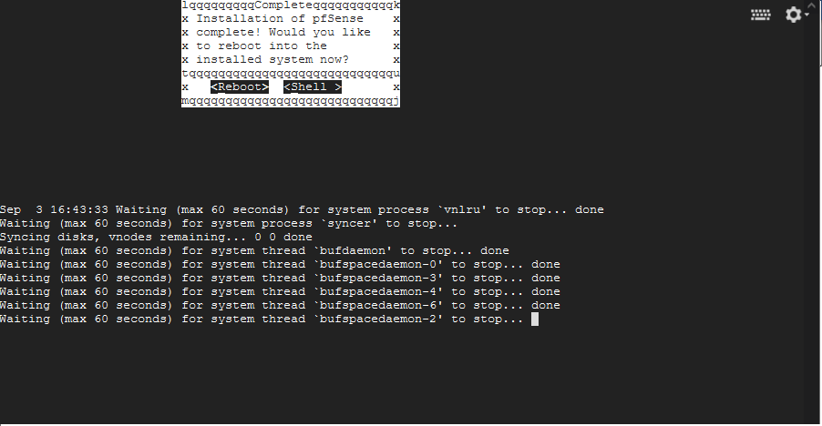

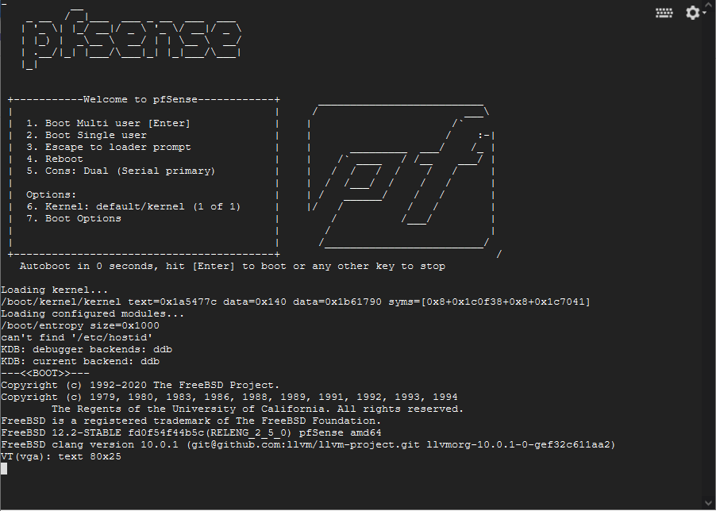

"Should VLANs be setup now": No 
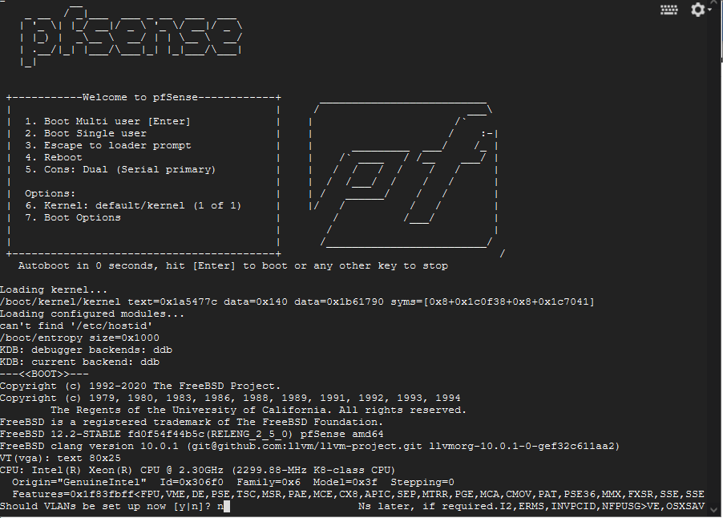

type in `vtnet0` 
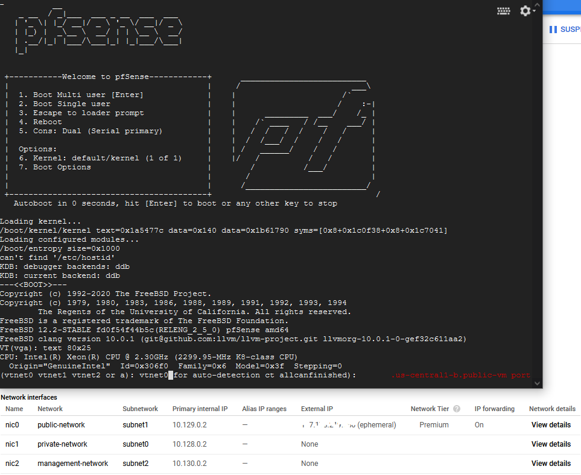

Hit Enter 
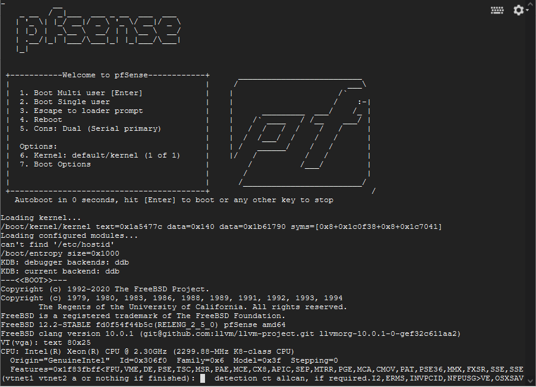

"Do you want to proceed": Yes 
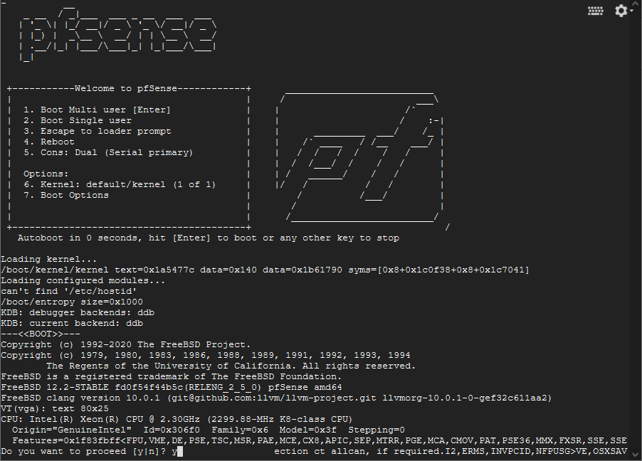

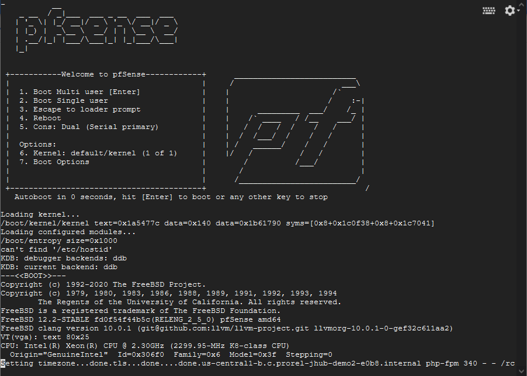

Select option 8 
type in `pfSh.php playbook disablereferercheck` 
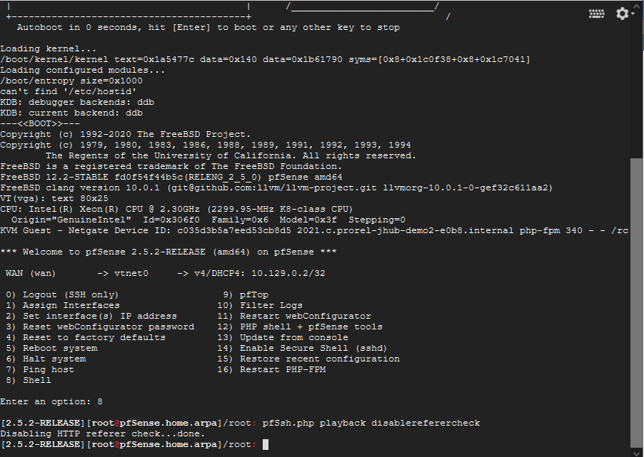

Open up a browswer and connect to the public IP address of the instance.

| Credentials | Default |
| ----------- | ------- |
| username    | admin   |
| password    | pfsense |