# How to install pfSense

After the [pfSense image has been created](../create-pfsense-image/), now install pfSense.

1. Navigate to the Compute Engine.
1. Select the Serial Console button. This will launch a new dialog window.
1. Follow the screenshots to install:

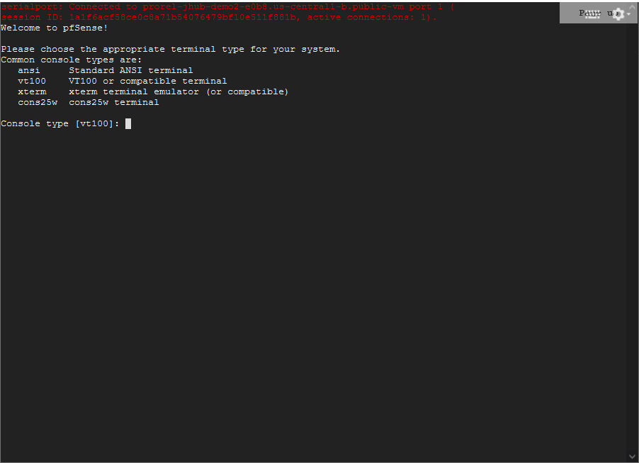

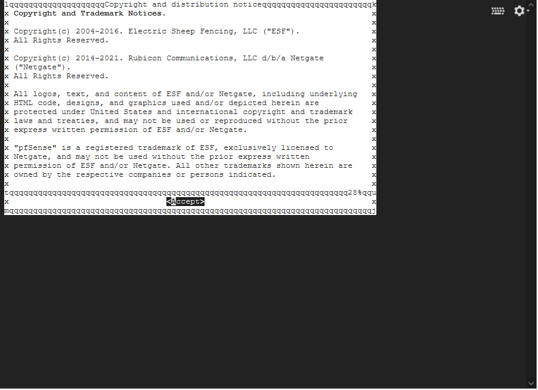

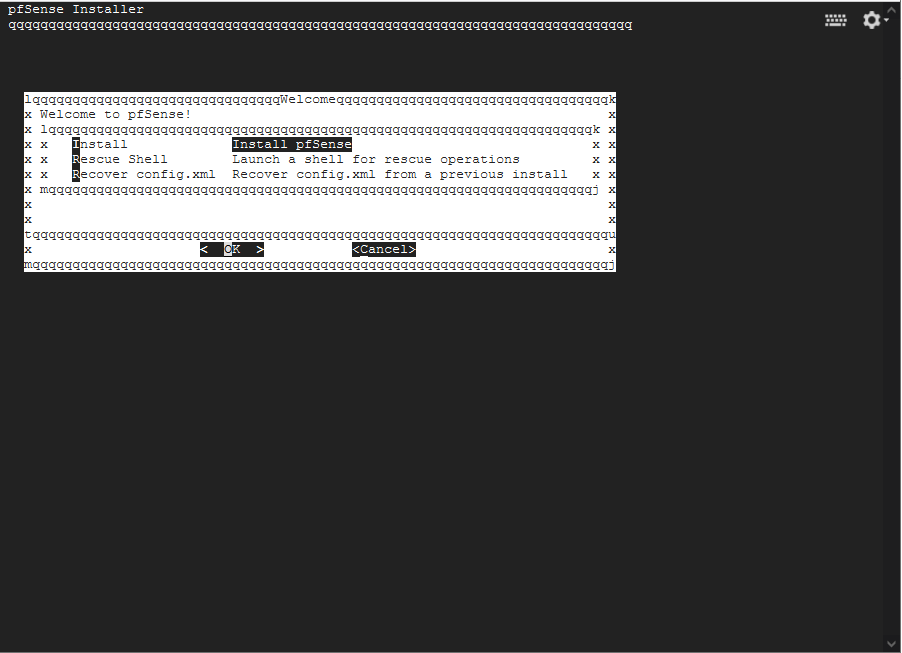

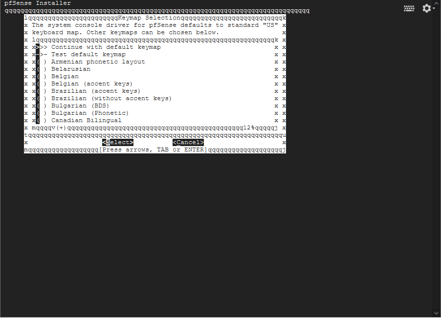

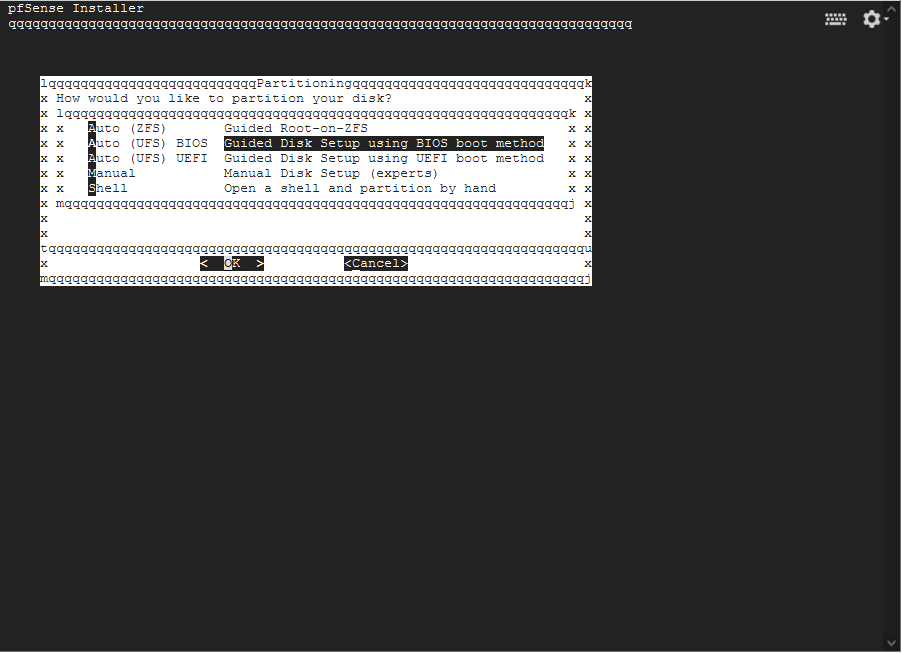

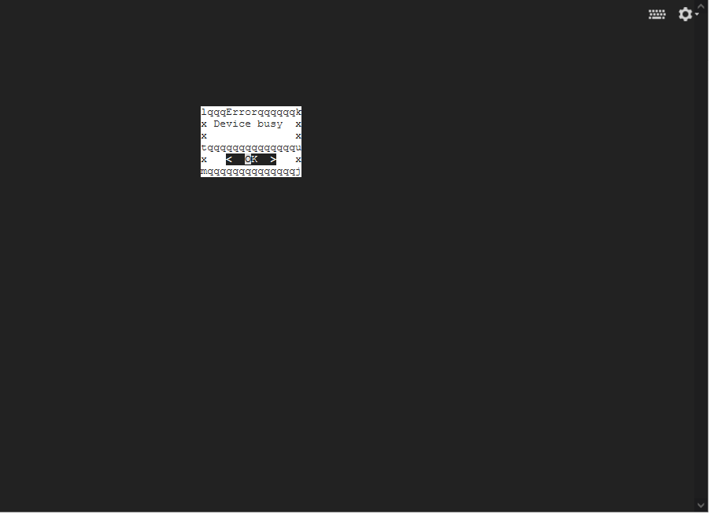

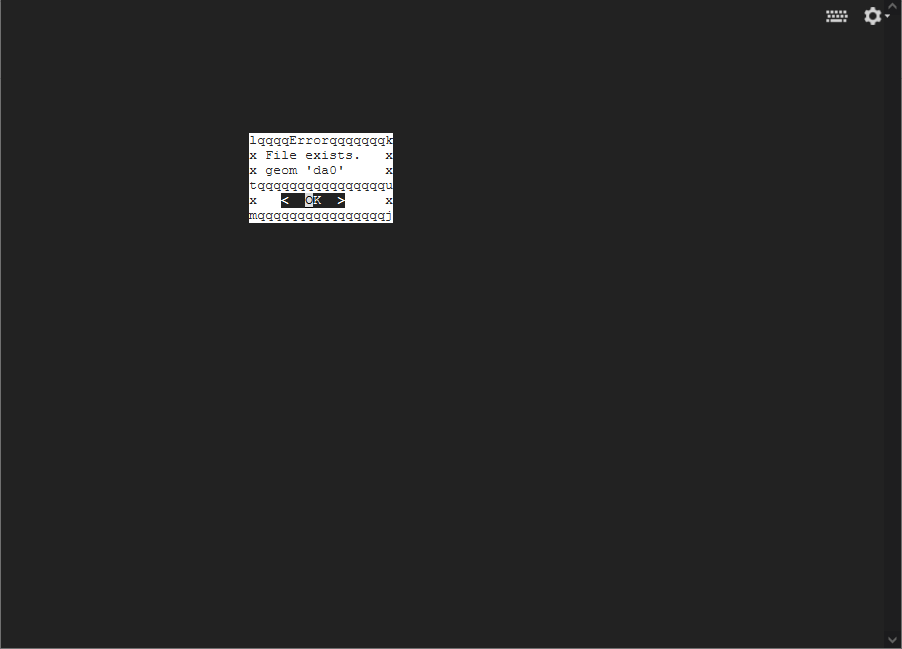

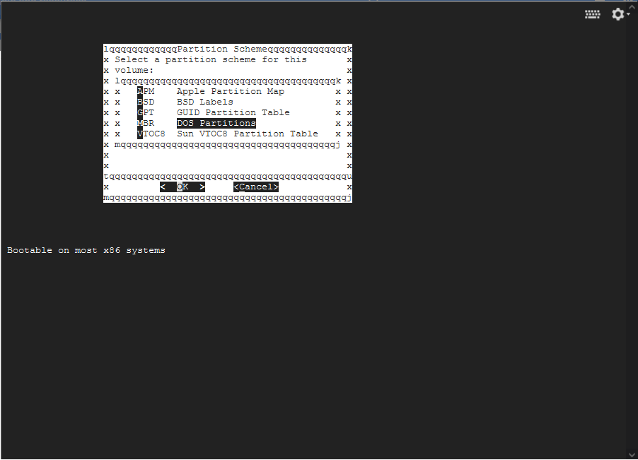

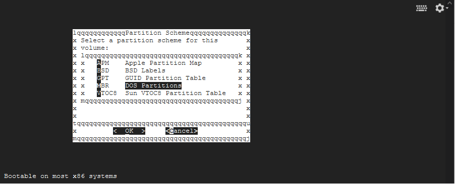

Make sure you select `Cancel` 
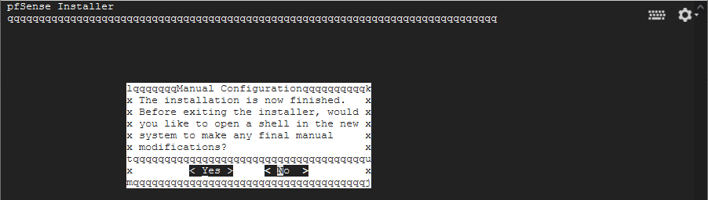

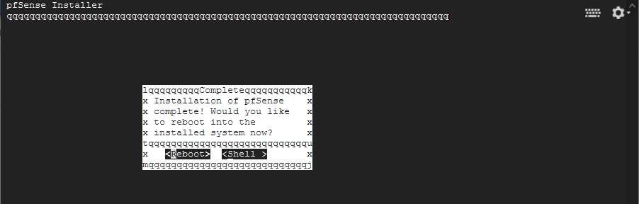

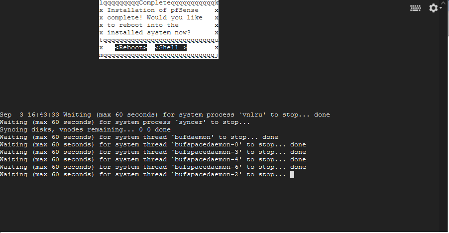

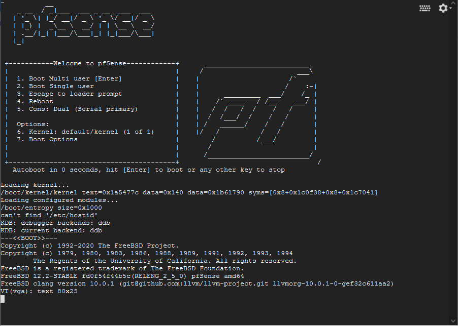

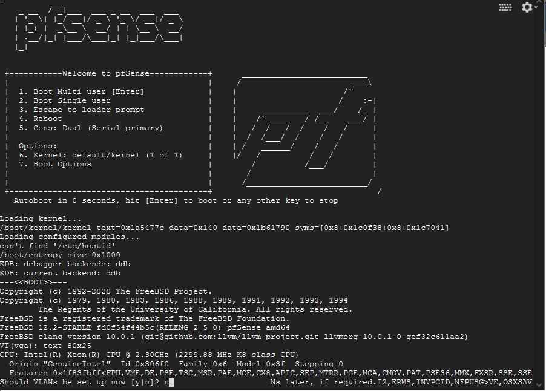

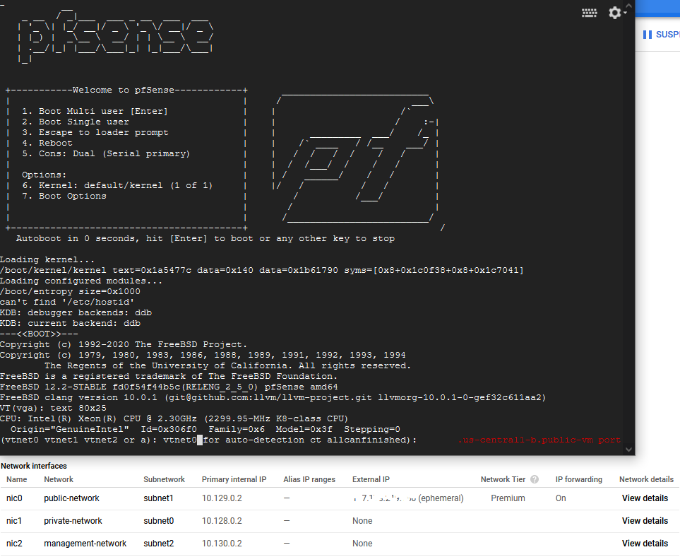

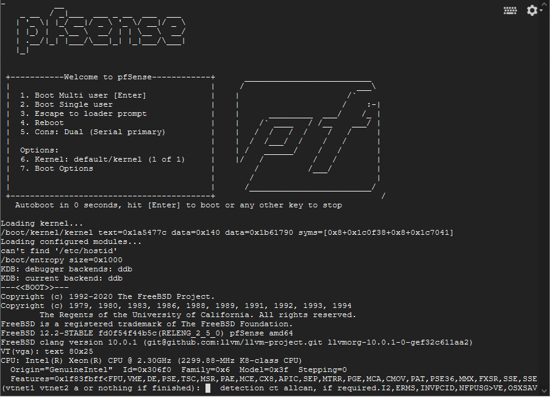

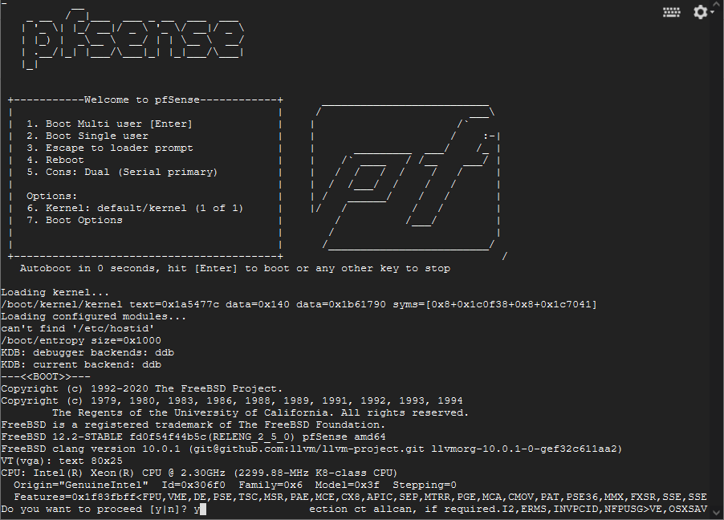

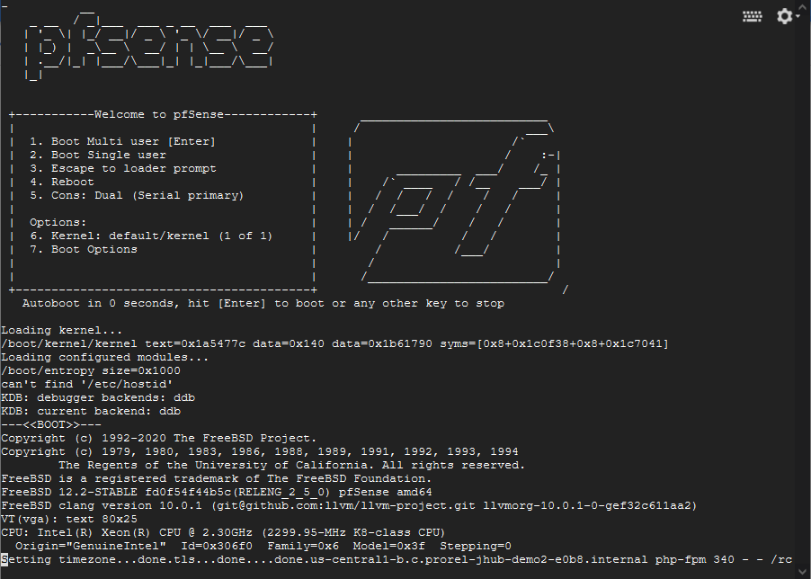

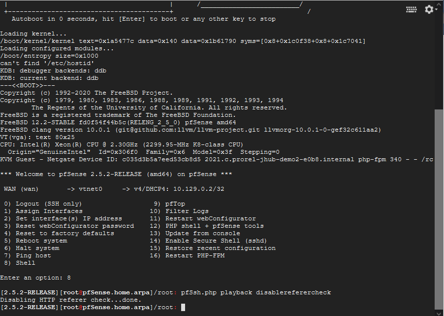