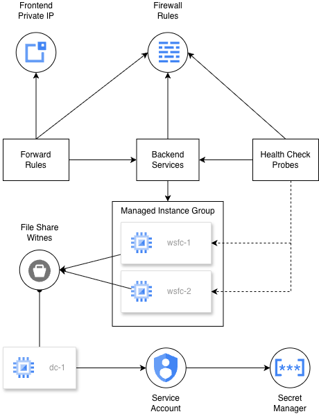

# Terraform Code to Windows Server Failover Cluster

The code here deploys a failover cluster using Windows Server on Google Cloud.

## Architecture



The code in this repo will deploy the following:

* A two node cluster running in GCP
* An Active Directory domain controller will be deployed with a fileshare witness

## Features

* Create the network environment including firewall rules.
* Use a Cloud DNS private forwarding zone to integrate Google Cloud's internal DNS with Active Directory DNS.
* Create two domain controllers in different zones.
* Deploy Compute Engine instance without external addresses and connect to it using IAP for TCP forwarding.
* Configure Active Directory Sites & Replication.

### Pre-requirements
* A GCP project must already exist
* IAP API must be enabled and appropriate IAM permissions to allow connectivity to the private test instance

## Getting Started

1. Run terraform commands.

```hcl
terraform init
terraform validate
terraform apply
```
2. When Terraform finishes, there will be three new instances named `test-dc-01`, `wsfc-1`, and `wsfc-2`.
3. After `test-dc-01`, the instance for the domain controller, is up and all the scripts to build a new forest are complete, the other instances will automatically join to the domain. Wait for those to complete. Look at the logs for each instance to the track the changes.
4. Use the Terraform output value `public_ip_active_directory` and use RDP to remote into this jumpbox.
   1. There are 2 sets of credentials that can be used. Either use the default `Administrator` account with the secret stored in Secrets Managers -or- monitor the `test-dc-01` console logs and wait for the scripts to finish creating the `cluster-admin` account with the default password of [Password1](./variables.tf:L122).
5. After both instances are domain joined, remote into `wsfc-1` from the jumpbox.
   1. use the `cluster-admin` and password to login.
6. When you've connected to `wsfc-1`, open up PowerShell 6 as an administrator. Navigate to `C:\Initializecluster.ps1` and run the script.
   1. To confirm things are working, you can open the Failover Cluster Manager under Server Manager and validate a new cluster called `testcluster` shows up.
7. Create an IIS Service within Failover Clustering.
   1. In Failover Cluster Manager, in the Action pane, select Configure Role.
   2. In the Select Role page, select other Server.
   3. In the <b>Client Access Point</b> page, enter the name <b>IIS</b>.
   4. Set the address to <b>10.0.0.9</b>.
   5. Skip <b>Select Storage</b> and skip Resource Types.
   6. Confirm the settings and then click Finish.
   

## Troubleshooting

### Validating the load balancer

After your internal load balancer is running, you can inspect its status to validate that it can find a healthy instance, and then test failover again.

1. In the Google Cloud console, go to the Load balancing page.

2. Click the name of the load balancer (`wsfc-lb`).

    In the Backend section of the summary, you should see the instance groups listed.

    In the following image from the details page of the wsfc-lb load balancer, instance group wsfc-group-1 contains the active node, as indicated by 1 / 1 in the Healthy column. Instance group wsfc-group-2 contains the inactive node, as indicated by 0 / 1.

    Load balancer status shows 1 / 1 healthy instances in instance group
    wsfc-group-1, which indicates that it contains the active node.
    

    If both instance groups show 0 / 1, the load balancer might still be syncing with the nodes. Sometimes, you need to do at least one failover action to get the load balancer to find the IP address.

3. In Failover Cluster Manager, expand the cluster name and click on Roles. In the Owner Node column, note the server name for the IIS role.

4. Start a failover by right-clicking the IIS role and selecting Move > Best Possible Node. This action moves the role to the other node, as shown in the Owner Node column.


5. Wait until the Status shows Running.

6. Return to the Load balancer details page, click Refresh, and verify that the 1 / 1 and 0 / 1 values in the Healthy column have switched instance groups.

   

### Active Directory

* This repo will deploy a single Active Directory domain controller with a default name of `test-dc-01`.
* Terraform utilizes the `sysprep-specialize-script-ps1` in the [metadata](./vm-dc.tf#L41) to install the necessary services like `AD-Domain-Services`. This script is ran one time during the inital boot.
* After the services in the metedata have been installed, the instance will restart and launch the script defined in the `windows-startup-script-ps1` on each reboot. This script called [dc-startup](./scripts/dc-startup.ps1), contains the logic to configure a Windows Domain and after a new Windows Domain is configured, the logic in the script will create a second user account and make it a Domain Admin. The logic will then wait for the other instances to join the domain.


### Windows Failover Clusters

* As the Active Directory instance installs ADDS and configures a new Windows Domain, two new Windows Server Failover Clusters will be deployed.
* Terraform utilizes the `sysprep-specialize-script-ps` in the [metadata](./vm-cluster.tf#L39) to launch the [specialize-node](./scripts/specialize-node.ps1) script on the first initial boot. The script will install the necessary features for WFSC and IIS. The script will add any local Windows Firewall rules, add a custom default webpage with the hostname, and set the NIC with a static IP address. A requirement for Windows Failover clustering.
* After the first script runs, a second script called [join-domain](./scripts/join-domain.ps1) executes on every reboot because the `windows-startup-script-ps1` [metadata](./vm-cluster.tf#L40) is set. This script waits for the Windows Domain to become available, then automatically joins the instance to the domain. Once the instance is part of the domain, the script runs again. This time, it detects the domain membership and generates a script to create a new Failover Cluster. That generated script is saved on the instance at:
[C:\InitializeCluster.ps1](./scripts/join-domain.ps1#L83).

<!-- BEGIN_TF_DOCS -->


## Inputs

| Name | Description | Type | Default | Required |
|------|-------------|------|---------|:--------:|
| <a name="input_AdDnsDomain"></a> [AdDnsDomain](#input\_AdDnsDomain) | Active Directory domain (FQDN) | `string` | `"contoso.local"` | no |
| <a name="input_AdNetbiosDomain"></a> [AdNetbiosDomain](#input\_AdNetbiosDomain) | Active Directory domain (NetBIOS) | `string` | `"CLOUD"` | no |
| <a name="input_auto_restart"></a> [auto\_restart](#input\_auto\_restart) | Set if the instance should auto-restart. | `bool` | `false` | no |
| <a name="input_boot_disk"></a> [boot\_disk](#input\_boot\_disk) | What image the instance should boot from. | `string` | `"windows-cloud/windows-2019"` | no |
| <a name="input_cidr_prefix"></a> [cidr\_prefix](#input\_cidr\_prefix) | Must be given in CIDR notation. The assigned supernet. | `string` | `"10.0.0.0/15"` | no |
| <a name="input_cluster_name"></a> [cluster\_name](#input\_cluster\_name) | Windows server failover cluster name | `string` | `"testcluster"` | no |
| <a name="input_cluster_password"></a> [cluster\_password](#input\_cluster\_password) | The password used by the default `cluster-admin` Active Diretory | `string` | `"Password1"` | no |
| <a name="input_cluster_username"></a> [cluster\_username](#input\_cluster\_username) | The Active Directory name to be used by the WSFC cluster. | `string` | `"cluster-admin"` | no |
| <a name="input_dc_machine_type"></a> [dc\_machine\_type](#input\_dc\_machine\_type) | Machine type to deploy for the Domain Controller | `string` | `"e2-medium"` | no |
| <a name="input_default_app_port"></a> [default\_app\_port](#input\_default\_app\_port) | WSFC default application port | `string` | `"59998"` | no |
| <a name="input_environment"></a> [environment](#input\_environment) | Environment | `string` | `"test"` | no |
| <a name="input_list_instances"></a> [list\_instances](#input\_list\_instances) | Map of instances and their properties | <pre>map(object({<br/>    name         = string<br/>    machine_type = string<br/>    zone         = string<br/>    preemptible  = string<br/>  }))</pre> | <pre>{<br/>  "wsfc1": {<br/>    "machine_type": "e2-standard-2",<br/>    "name": "wsfc-1",<br/>    "preemptible": false,<br/>    "zone": "b"<br/>  },<br/>  "wsfc2": {<br/>    "machine_type": "e2-standard-2",<br/>    "name": "wsfc-2",<br/>    "preemptible": false,<br/>    "zone": "c"<br/>  }<br/>}</pre> | no |
| <a name="input_list_reserved_ips"></a> [list\_reserved\_ips](#input\_list\_reserved\_ips) | Map of reserved IPs to be created. Address is the last octet in the CIDR | <pre>map(object({<br/>    name    = string<br/>    address = string<br/><br/>  }))</pre> | <pre>{<br/>  "cluster_ip": {<br/>    "address": 8,<br/>    "name": "reserved-cluster-ip"<br/>  },<br/>  "dc1": {<br/>    "address": 6,<br/>    "name": "reserved-addc1"<br/>  },<br/>  "loadbalancer": {<br/>    "address": 9,<br/>    "name": "reserved-ilb"<br/>  },<br/>  "wsfc1": {<br/>    "address": 4,<br/>    "name": "reserved-wsfc-1"<br/>  },<br/>  "wsfc2": {<br/>    "address": 5,<br/>    "name": "reserved-wsfc-2"<br/>  }<br/>}</pre> | no |
| <a name="input_managed_ad_dn"></a> [managed\_ad\_dn](#input\_managed\_ad\_dn) | Managed Active Directory domain (eg. OU=Cloud,DC=example,DC=com). | `string` | `"DC=contoso,DC=local"` | no |
| <a name="input_preemptible"></a> [preemptible](#input\_preemptible) | Set if this instance should be preemptible | `bool` | `true` | no |
| <a name="input_project_id"></a> [project\_id](#input\_project\_id) | The project ID | `string` | n/a | yes |
| <a name="input_project_services"></a> [project\_services](#input\_project\_services) | API services to enable | `list(any)` | <pre>[<br/>  "dns.googleapis.com",<br/>  "secretmanager.googleapis.com",<br/>  "compute.googleapis.com"<br/>]</pre> | no |
| <a name="input_region"></a> [region](#input\_region) | n/a | `string` | `"us-central1"` | no |
| <a name="input_secret_id"></a> [secret\_id](#input\_secret\_id) | Name of the Secret. Note: not the actual password | `string` | `"ad-password"` | no |

## Outputs

| Name | Description |
|------|-------------|
| <a name="output_cluster_account"></a> [cluster\_account](#output\_cluster\_account) | The Acitve Directory account for cluster setup |
| <a name="output_private_addresses"></a> [private\_addresses](#output\_private\_addresses) | List of private addresses and assigned instances |
| <a name="output_public_ip_active_directory"></a> [public\_ip\_active\_directory](#output\_public\_ip\_active\_directory) | The public ip assigned to the active directory instance |
<!-- END_TF_DOCS -->
## References
* [Running Windows Server Failover Clustering](https://cloud.google.com/compute/docs/tutorials/running-windows-server-failover-clustering)
* [Configuring a SQL server failover cluster instances that uses Storage Spaces Direct](https://cloud.google.com/compute/docs/instances/sql-server/configure-failover-cluster-instance)
* [SQL Server Always On Groups Blueprint](https://github.com/GoogleCloudPlatform/cloud-foundation-fabric/tree/v43.0.0/blueprints/data-solutions/sqlserver-alwayson)
