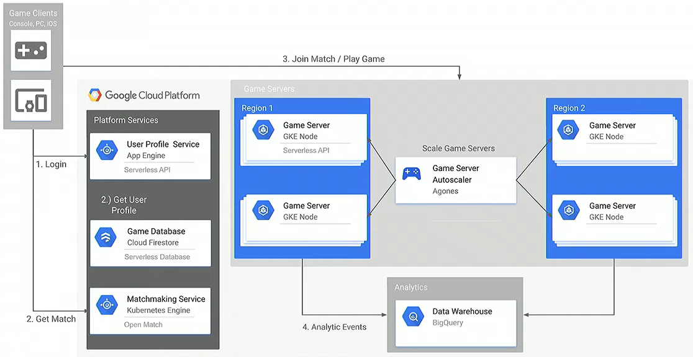

# [Game Servers](https://cloud.google.com/architecture/cloud-game-infrastructure)

**Conceptual Design**

**Detailed Design**

The frontend components of the gaming architecture include:
* Game Platform service that provide extra-game functionality
* Dedicated game servers that host the game.

The backend components of the gaming architecture include:
* Game state, persisteed in the system of record and typically stored in the game database.
* Analytics stack that stores and queries analytics and gameplay events.

## Frontend

* Provides interface that clients can interact with, either directly or through a load-balancer layer.
* Since exposed to the public, consider hardening against DoS attacks and malware.
    1. A client sends a request to the matchmaking serivce
    1. The matchmaking service sends connection information to the client
    1. The client can then connect directly to the dedicated game server using UDP

### Game Platform Services
* Provides game logic
* Game client typically communicates directly with the dedicated game server
* Provides the interface for meta-game functions, such as allowing players to join the same dedicated server instance, holding the "friend list".
* Some services:
    - Leaderboard and match history
    - Matchmaking
    - Online lobby
    - Chat
    - Profile
    - Feeds
    - Presense

### Dedicated Game Servers

Provide the game logic. To minimize latency perceived by the user, client game apps typically communicate directly with the dedicated game servers. This makes them part of the frontend service architecture.

## Backend

* External clients cannot talk directly
* Provides a way to store and access data, like game state data in a database or logging and analytics events in a data warehouse

### Game Database

* The database that holds the game-world state and player progression data.
* Game database design decisions:
    * **Make an informed decision** : Understand the type and frequency of the database access from your game at your expected player base, and at 10x those estimations.
    * **Don't assume one solution is the right solution**: Relational DB for in purhcases and storing game state in a NoSQL instance. NoSQL is better at handling high-volume, low-latency workloads while transactional databases provide guaranteed transactions.
    * **Back up your data**: Regular and geographically distribute backups

### Analytics

Both online services and game clients can send analytics and telemetry events to a common collection point, where the events are stored in a database. 

# [Transcoder API](https://cloud.google.com/transcoder/docs/concepts/overview)

* Output different formats including MPEG-4 (MP4), Dynamic Adaptive Streaming over HTTP (DASH) and HTTP Live streaming
* Ouput at different bitrates and resolutions
* Enhance the video output programmatically, including:
    * Crop video dimensions
    * Instert overlay images or animations
* Configure low-level encoding parameters such as bitrate
* Specify audio loudness normalization
* Configure encryption of your ouput video
    * FairPlay Streaming for the HLS format
    * PlayReady for the MPEG-DASH format
    * Widevine for MPEG-DASH and HLS on Chromium web browsers and Android
* Insert ads
* Create thumbnails
