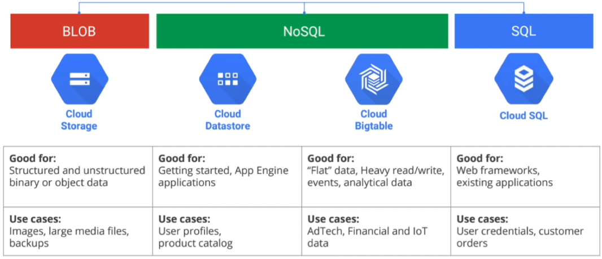

# GCP Storage Options

* Structured vs Unstructured
* Relational (SQL) vs Non-Relational (NoSQL)
* Transactional (OLTP) vs Analytical (OLAP)
* Fully Managed vs Requires Provisioning
* Global vs Regional
* Horizontal vs Vertical scaling

<b>Overview</b>
|       | Cloud Datastore | Bigtable | Cloud Storage | Cloud SQL | Cloud Spanner| BigQuery |
|  ---  |  ---  |  ---  |  ---  |  ---  |  ---  |  ---  |
| Type      | NoSQL | NoSQL Wide Column | Blob Storage | Relational SQL-OLTP | Relational SQL-OLTP | Relational SQL-OLAP |
| Transactions | :heavy_check_mark: | Single-Row     | :x:      |  :heavy_check_mark:     |  :heavy_check_mark:   | :x:      |
| Complex Queries | :x:      | :x:      | :x:        |  :heavy_check_mark:    |  :heavy_check_mark:     |   :heavy_check_mark:    |
| Capacity | TBs      | PBs      | PBs      | Up to ~64TB      | PB      | PB      |
| Unit Size | 1MB/entity      | ~10MB/cell ~100MB/row     | 5TB per obj.      | Depends on DB engine      | 10,240 MiB/row      | 19MB/row       |
| Workload type | App Engine      | Flat data, heavy read/write events, analytical data      | Structured or unstructured binary or object data      | Web apps       | Large-scale db apps      | Interactive quering, offlien anayltics       |
| Global :earth_americas: vs Regional :japan: | :japan: | :earth_americas: | :earth_americas: | :japan: | :earth_americas: | :earth_americas: |
| Horizontal vs Vertical | | | | Vertial | Horizontal| |
| Managed vs Provisioned | | | | Provisioned |  | Managed |

|       |   Relational    |  Relational     |  NoSQL/Nonrelational     |  NoSQL/Nonrelational  | NoSQL/Nonrelational       | NoSQL/Nonrelational      |
|  ---  |  ---  |  ---  |  ---  |  ---  |  ---  |  ---  |
|       | Cloud Spanner  | Cloud SQL    | Bigtable      | Firestore   | Firebase Realtime      | Memorystore      |
| Scale insurance  | :heavy_check_mark: | | :heavy_check_mark: | :heavy_check_mark: | | |
| Data distribution| Regional or Global | Zonal | Regional or Global      | Regional or Global |Zonal | Zonal      |
| Replica consistency | strong  | strong | eventual | strong | n/a | eventual |
| Multi-primary | :heavy_check_mark:      |       | :heavy_check_mark:      |  :heavy_check_mark:     |       |       |

<b>Storage Options Flowchart</b>

<b>Compare Storage Options</b>

## Google Cloud Storage
* Durable and highly available object storage (like AWS S3)
* Supports unstructered data storage
* Data encryption in-flight and at rest
* Unlimited storage with no minimum object size with a maximum unit size of 5 TB per object
* Worldwide accessibility and worldwide storage locations.
* Low latency (time to first byte typically tens of milliseconds).
* High durability (99.999999999% annual durability).
* Geo-redundancy if the data is stored in a multi-region or dual-region.
* <u>Usage Patterns</u>
    * Images, pictures, and videos
    * Objects and blobs
    * Unstructured data
    * Long term storage for archival or compliance
* Simple [pricing model](https://cloud.google.com/storage/pricing)
    * Network ingress and data transfer within a region is free
    * Network egress charges apply and vary by destination
* All storage classes accessed through the same APIs
* [Four Storage Classes](https://cloud.google.com/storage/docs/storage-classes)

|  Storage Class | Min. duration | Monthly availability | Usecase |
|  ---  |  ---  |  ---  | --- |
| `STANDARD` | None      | * >99.99% in multi-regions and dual regions  * 99.00% in regions  | Best for frequently accessed data ("hot" data) |
| `NEARLINE`  | 30 days      | * 99.95% in multi-regions and dual regions  * 99.9% in regions | Lower availability, a 30-day min. storage duration like data backup, long-tail multimedia, and data archiving |
|  `COLDLINE`| 90 days      | * 99.95% in multi-regions and dual-regions  * 99.9% in regions      | Mainly for backup or archiving purposes |
| `ARCHIVE` | 365 days      | * 99.95% in multi-regions and dual-regions  * 99.9% in regions | Low-cost highly available for data archive, online backups and DR |

### Availability

The availability of Standard storage data is:
| Location Type | Availability SLA^1 | Typical monthly availability |
| --- | --- | --- |
| multi-region | 99.95% | >99.99% |
| dual-region | 99.955 | >99.99% |
| region | 99.9% | 99.99% |
^1 The availability SLA is the monthly uptime percentage backed by the Cloud Storage SLA.

## [Cloud Bigtable](https://cloud.google.com/bigtable/docs/overview)

* Scales to billions of rows and thousands of columns to store terrabytes/petabytes of data.
* Ideal for storing very large amounts of single-keyed data with very low latency.
* Ideal data source for MapReduce operations
* What it's good for:
    * Internet of Things data
    * Graph data
    * Financial data like transaction history, stock prices
    * Marketing data like purchase history
* Bigtable is not a relational database.
* Does not support SQL queries, joins, or multi-row transactions.
* Not transactional and does not support ACID
* Eventual consistency

## Cloud SQL

* provides fully managed, <u>relational SQL databases</u>
* offers MySQL, PostgreSQL, MSSQL databases as a service
* manages OS & Software installation, patches and updates, backups and configuring replications, failover however needs to select and provision machines
* Up to 64 TB, depending on machine type
* HA architectures and Read Replicas are available. HA failore does impose downtime
* Usage
    * OLTP workloads
    * Relational database
* What it's good for:
    * Websites, blogs, and MCS
    * BI Apps
    * CRM, eCommerce

## [Cloud Spanner](https://cloud.google.com/spanner#all-features)
* Fully managed <u>Relational SQL databases</u>
* provides cross-region, global, horizontal scalability, and availability, and ACID transactions
* 99.999% availability for multi-regional instances
* automatic sharding
* supports strong consistency, including strongly consistent secondary indexes
* database sizes exceeding > 2TB
* 0% downtime
* Usage:
    * OLTP Workloads
    * Full relational SQL support
    * Horizontal scale up to petabytes
* What it's good for:
    * Financials like payment gateways that need to be 100% consistent

## Cloud Datastore
* Fully managed <b>NoSQL</b> for automatic scaling
* encryption at rest
* fully managed with no planned downtime
* Atomic transactions
* SQL-like query language
* Firestore is the newest version of Datastore
* Built on top of Bigtable
* What it's good for:
    * Designed for mobile and web apps
    * product catalogs that provide real-time inventory
    * User Profiles
    * Transactions based on ACID properties like refunds from a bank

## [BigQuery](https://cloud.google.com/bigquery)
* provides fully managed, no-ops (serverless),  OLAP, enterprise data warehouse (EDW) with SQL and fast ad-hoc queries.
* provides high capacity, data warehousing analytics solution
* ideal for big data exploration and processing
not ideal for operational or transactional databases
* provides SQL interface
* Usage Patterns
    * OLAP workloads up to petabyte-scale
    * Big data exploration and processing
    * Reporting via business intelligence (BI) tools
* Anti Patterns
    * Not an ideal storage option for transactional data or OLTP – Use Cloud SQL or Cloud Spanner instead
    * Low-latency read/write access – Use Bigtable instead
* Common Use cases
    * Analytical reporting on large data
    * Data science and advanced analyses
    * Big data processing using SQL

## [Memorystore](https://cloud.google.com/memorystore)
* provides scalable, secure, and highly available in-memory service for Redis and Memcached.
* fully managed as provisioning, replication, failover, and patching are all automated, which drastically reduces the time spent doing DevOps.
* provides 100% compatibility with open source Redis and Memcached
* is protected from the internet using VPC networks and private IP and comes with IAM integration
* Usage Patterns
    * Lift and shift migration of applications
    * Low latency data caching and retrieval
* Anti Patterns
    * Relational or NoSQL database
    * Analytics solution
* Common Use cases
    * User session management

## [Persistent Disk](https://cloud.google.com/compute/docs/disks)
* Block storage for Compute Engine virtual machines
* The data on each persistent disk is distributed across several physical disks.
* Persistent disks are located independently from your virtual machine (VM) instances, so you can detach or move persistent disks to keep your data even after you delete your instances.
* Performance:
    * scales automatically with size
* Disk Types:

| | Zonal STD disk      | Regional STD disk | Zonal Balanced Disk | Regional Balanced disk      |
|  ---  |  ---  |  ---  |  ---  |  ---  |
| Storage type        | Efficient and reliable block storage | Syncrhonous replication acorss two zones      | Cost-effect and reliable block storage      | Cost-effective storage w/synchronous replicatio across 2 zones      |
| Min cap per disk    | 10 GB      |  200GB     |  10 GB     |  10 GB     |
| Max cap             | 64 TB      |  64 TB     |  64 TB     |  64 TB     |
| Scope               | Zone   | Zone      | Zone      | Zone      |
| Data redundancy  | Zonal  | Multi-Zonal      |  Zonal     |   Multi-Zonal     |

## [Local SSD](https://cloud.google.com/compute/docs/disks#localssds)
* High performance, transient, local block storage
* You must manage striping on local SSDs yourself
* GCE automatically encrypts your data when it is written to local SSD storage

## Filestore
* High performance file storage (NFS)
